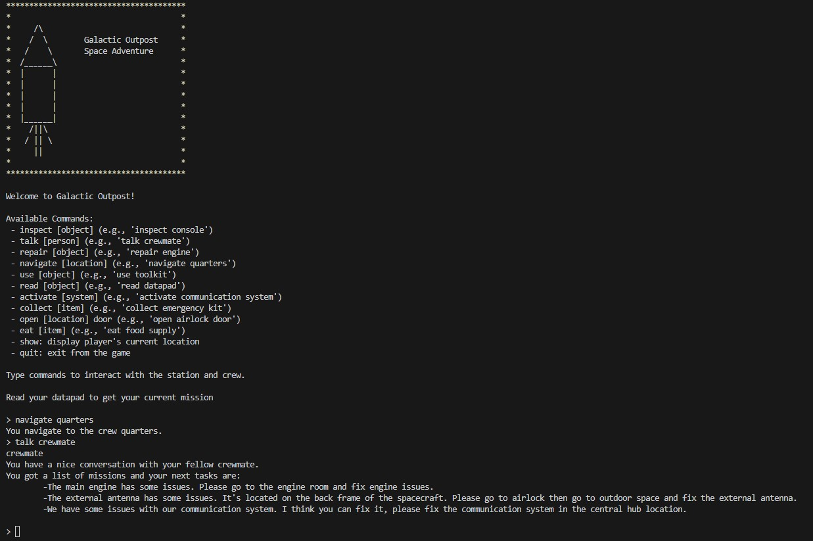

# Galactic Outpost: Space Adventure Game

## Description

Galactic Outpost is a text-based adventure game set in a space station. Players assume the role of a crew member tasked with managing the station and solving various challenges. The game is developed using the Model-View-Controller (MVC) design pattern, providing an immersive and interactive experience.

## Features

- Explore different areas of the space station.
- Complete a series of missions to ensure the smooth operation of the station.
- Interact with objects and crew members through a variety of commands.

## Commands

Players can use the following commands to interact within the game:

- `inspect [object]`: Look closely at an object.
- `talk [person]`: Communicate with a crew member.
- `repair [object]`: Fix a malfunctioning object.
- `navigate [location]`: Move to different areas of the station.
- `use [object]`: Utilize an item.
- `read [object]`: Look at documents or screens.
- `activate [system]`: Turn on a machine or system.
- `collect [item]`: Gather items.
- `enter [location]`: Go into a room or space.
- `eat [item]`: Consume food.

### Objects, items and system
- **Console**: Interact with the station's main control system.
- **Engine**: Check the condition of the station's engine.
- **Datapad**: A device containing mission updates and logs.
- **Airlock**: Entry and exit point for spacewalks.
- **Food Supply**: Source of nutrition for the crew.
- **Space Snacks**: Quick and tasty treats for energy.
- **Astronaut Ice Cream**: A special dessert for space travelers.
- **Protein Bar**: A compact and nutritious snack.
- **Communication System**: Key for contacting Earth and receiving instructions.
- **Emergency Kit**: Contains vital supplies for critical situations.
- **Antenna**: An external device essential for long-range communications.
- **Toolkit**: A set of tools for various repair tasks.
- **Crewmate**: Your colleagues aboard the station, a source of information and assistance.

### Locations
- **Central Hub**: The heart of the space station.
- **Airlock**: Entry and exit point for spacewalks.
- **Quarters**: Resting area for the crew.
- **Engine Room**: Location of the station's main engine.

## Missions

To progress through the game, players must complete the following missions:

1. **Talk with Crewmates**: Gather information and tasks from fellow crew members.
2. **Fix Engine**: Repair the station's main engine in the engine room.
3. **Fix External Antenna**: Resolve issues with the external antenna located on the spacecraft's back frame.
4. **Restore Communication**: Repair the communication system in the central hub.

## Design Patterns

The game utilizes the following design patterns:

- **Model-View-Controller (MVC)**: Separates the game's logic (Model), user interface (View), and control flow (Controller), enhancing maintainability and scalability.
- **Command Pattern**: Encapsulates each action as a command object, allowing for flexible command processing and extension.

## Installation and Running the Game

1. **Clone the Repository**: Clone the game repository to your local machine using Git.

```shell
git clone https://github.com/suxrobGM/galactic-outpost-game
```

2. **Navigate to the Project Directory**:

```shell
cd galactic-outpost-game/src
```

3. **Compile the Game** (if applicable):

```shell
javac GameMain.java
```

4. **Run the Game**:
```shell
java GameMain
```
5. **Start Playing**: Follow the on-screen instructions to start your adventure in the Galactic Outpost!

## Screenshots

